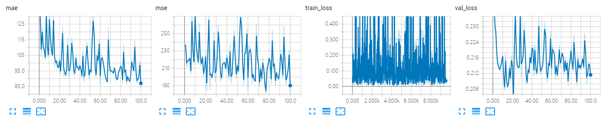
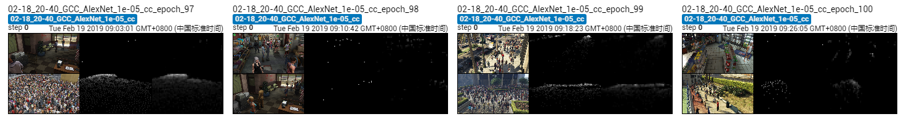

The results of AlexNet on GCC dataset using cross-camera splitting.

The model is trained ~100 epoches, which achieves MAE of **83.7** and MSE of **180.3**. 

## Screenshot of Training Process

## Visualization of Density Map

