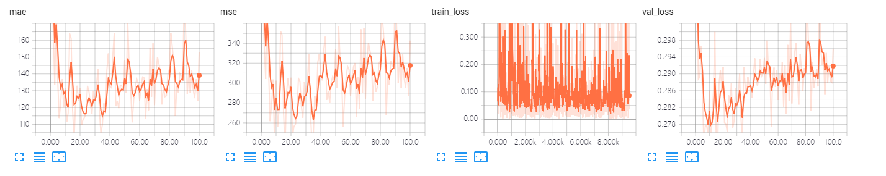
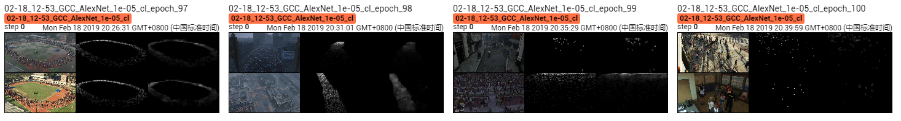

The results of AlexNet on GCC dataset using cross-location splitting.

The model is trained ~100 epoches, which achieves MAE of **101.2** and MSE of **233.6**. 

## Screenshot of Training Process

## Visualization of Density Map

