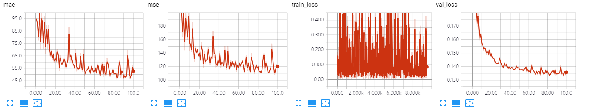

The results of AlexNet on GCC dataset using random splitting.

The model is trained ~100 epoches, which achieves MAE of **46.3** and MSE of **110.9**. 

## Screenshot of Training Process

## Visualization of Density Map

