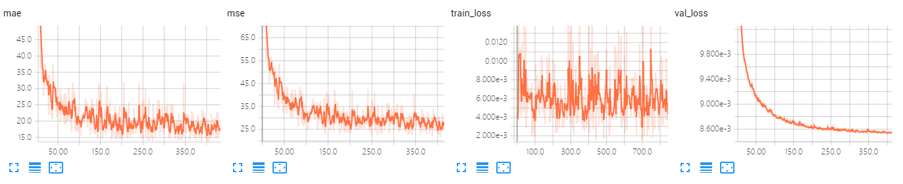
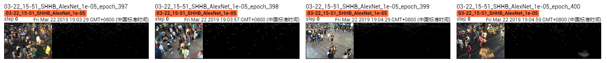

The results of AlexNet on Shanghai Tech Part B.

The model is trained ~400 epoches, which achieves MAE of **13.6** and MSE of **21.7**. 

## Screenshot of Training Process

## Visualization of Density Map

