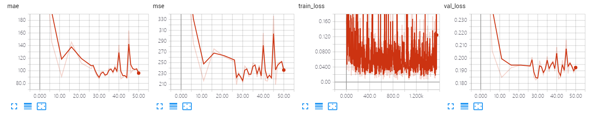
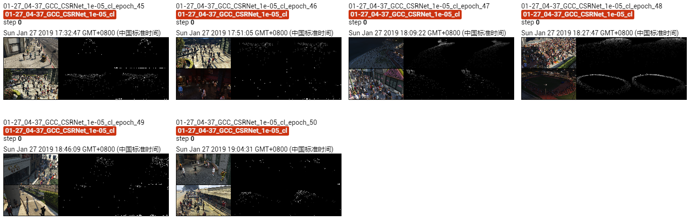

The results of CSRNet on GCC dataset using Cross-location splitting.

The model is trained ~50 epoches, which achieves MAE of **87.3** and MSE of **217.2**. 

## Screenshot of Training Process

## Visualization of Density Map

