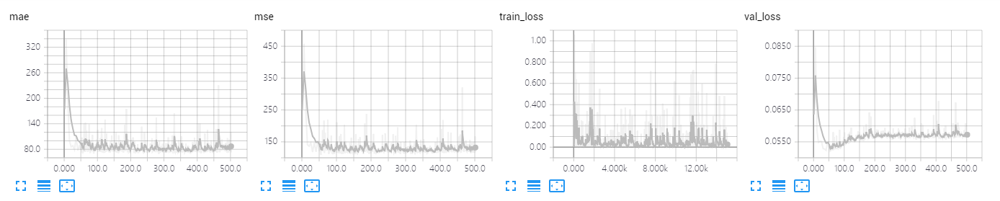
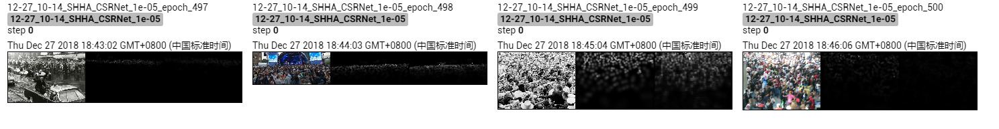

The results of CSRNet on Shanghai Tech A dataset.

The model is trained ~300 epoches, which achieves MAE of **69.3** and MSE of **111.9**. 

## Screenshot of Training Process

## Visualization of Density Map

