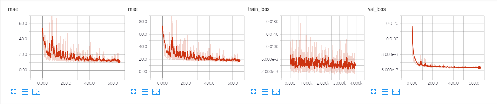
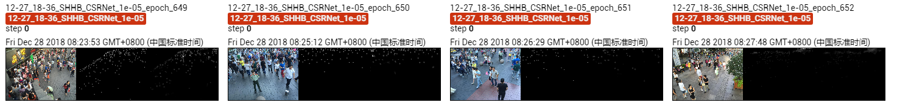

The results of CSRNet on Shanghai Tech B dataset.

The model is trained ~600 epoches, which achieves MAE of **10.6** and MSE of **16.2**. 

## Screenshot of Training Process

## Visualization of Density Map

