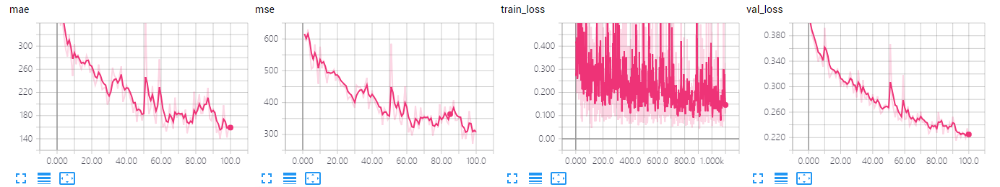
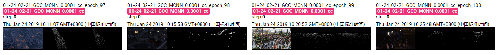

The results of MCNN on GCC dataset using cross-camera splitting.

The model is trained ~100 epoches, which achieves MAE of **140.3** and MSE of **285.7**. 

## Screenshot of Training Process

## Visualization of Density Map

