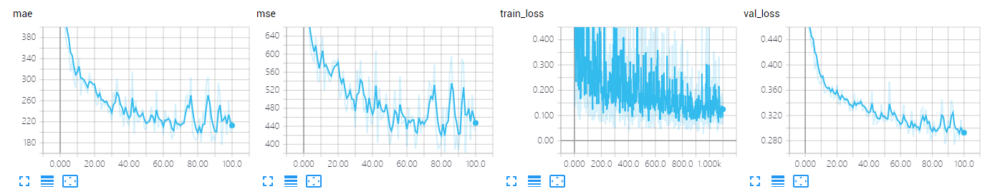
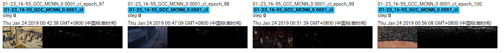

The results of MCNN on GCC dataset using cross-location splitting.

The model is trained ~100 epoches, which achieves MAE of **176.1** and MSE of **373.9**. 

## Screenshot of Training Process

## Visualization of Density Map

