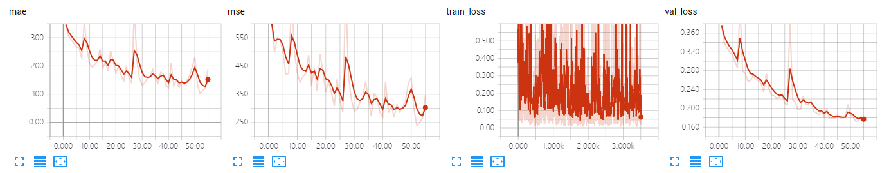
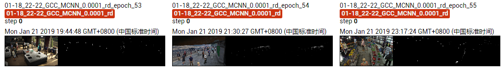

The results of MCNN on GCC dataset using random splitting.

The model is trained ~60 epoches, which achieves MAE of **102.2** and MSE of **238.3**. 

## Screenshot of Training Process

## Visualization of Density Map

