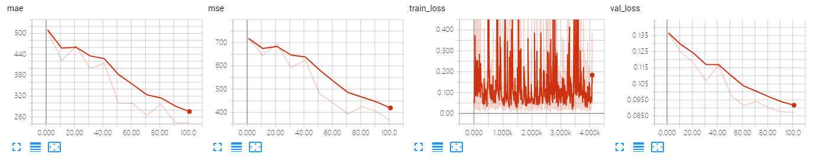
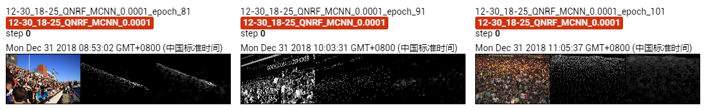

The results of MCNN on UCF-QNRF dataset.

The model is trained only ~100 epoches, which achieves MAE of **243.5** and MSE of **364.7**. 

## Screenshot of Training Process

## Visualization of Density Map

