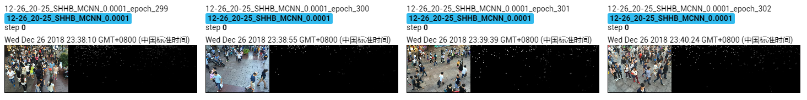

The results of MCNN on Shanghai Tech B dataset.

Due to the limited time and machine, the model is trained only 300 epoches, which achieves MAE of **21.5** and MSE of **38.1**. 

## Screenshot of Training Process

## Visualization of Density Map

