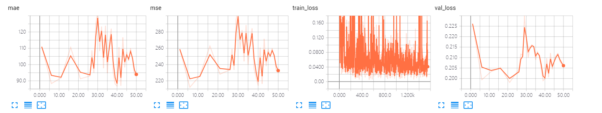
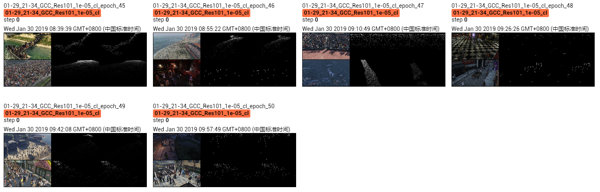

The results of ResNet 101 on GCC dataset using cross-location splitting.

The model is trained 50 epoches, which achieves MAE of **86.9** and MSE of **214.2**. 

## Screenshot of Training Process

## Visualization of Density Map

