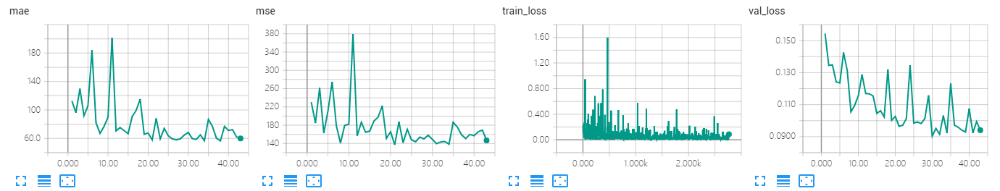
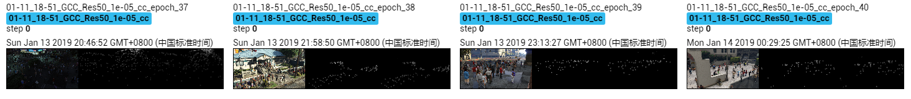

The results of ResNet 50 on GCC dataset using cross-camera splitting.

The model is trained 44 epoches, which achieves MAE of **54.5** and MSE of **129.7**. 

## Screenshot of Training Process

## Visualization of Density Map

