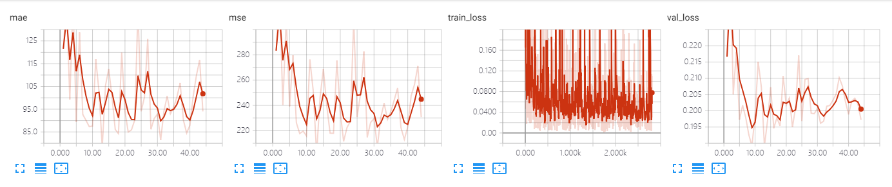
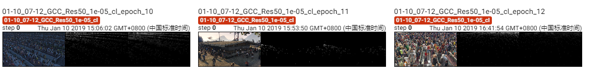

The results of ResNet 50 on GCC dataset using cross_location splitting.

The model is trained 121 epoches, which achieves MAE of **78.3** and MSE of **201.6**. 

## Screenshot of Training Process

## Visualization of Density Map

