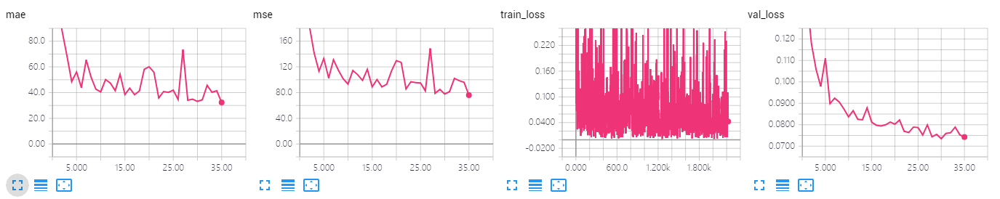
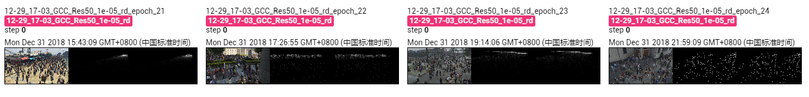

The results of ResNet 50 on GCC dataset using random splitting.

The model is trained 35 epoches, which achieves MAE of **32.4** and MSE of **76.1**. 

## Screenshot of Training Process

## Visualization of Density Map

