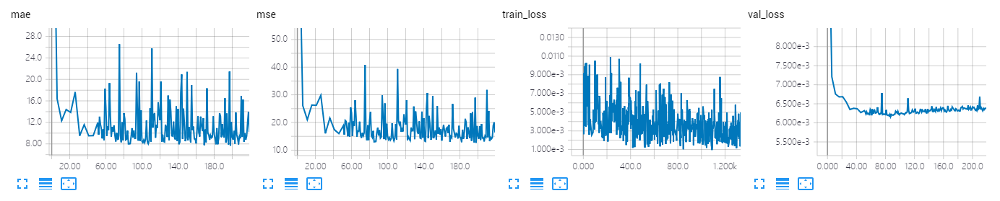
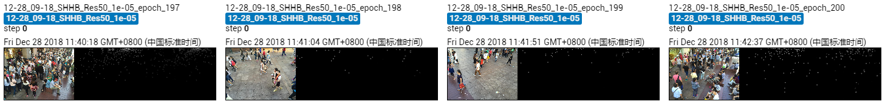

The results of Res50 on Shanghai Tech B dataset.

Due to the limited time and machine, the model is trained only 200 epoches, which achieves MAE of **7.7** and MSE of **12.6**. Training more time will achieve a better result.

## Screenshot of Training Process

## Visualization of Density Map

