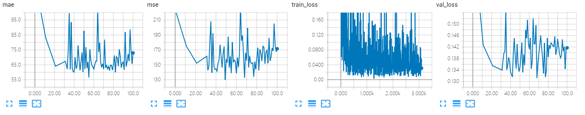
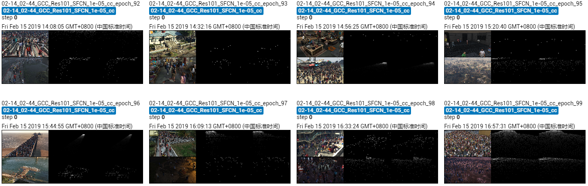

The results of ResSFCN on GCC dataset using cross-camera splitting.

The model is trained 50 epoches, which achieves MAE of **56.5** and MSE of **139.0**. 

## Screenshot of Training Process

## Visualization of Density Map

