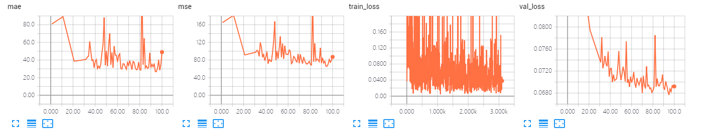
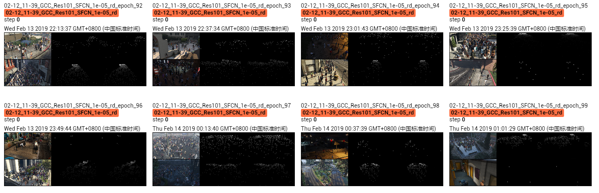

The results of ResSFCN on GCC dataset using random splitting.

The model is trained 50 epoches, which achieves MAE of **26.8** and MSE of **66.1**. 

## Screenshot of Training Process

## Visualization of Density Map

