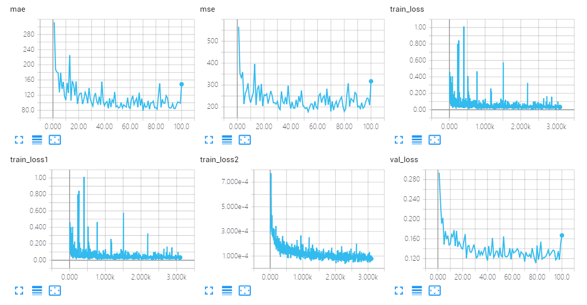
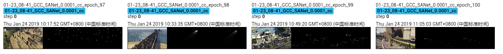

The results of SANet on GCC dataset using cross-camera splitting.

The model is trained 100 epoches, which achieves MAE of **79.3** and MSE of **179.9**. 

## Screenshot of Training Process

## Visualization of Density Map

