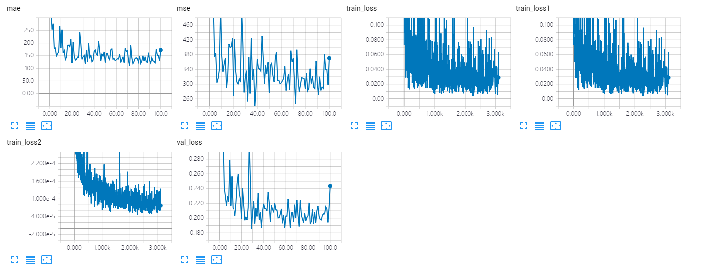
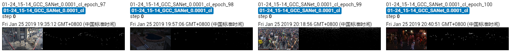

The results of SANet on GCC dataset using cross-location splitting.

The model is trained 100 epoches, which achieves MAE of **110.0** and MSE of **246.0**. 

## Screenshot of Training Process

## Visualization of Density Map

