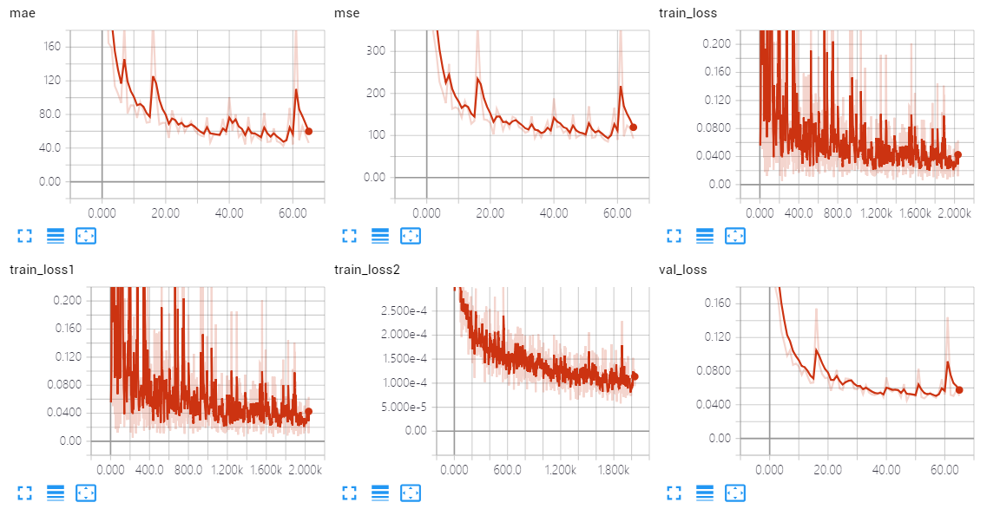
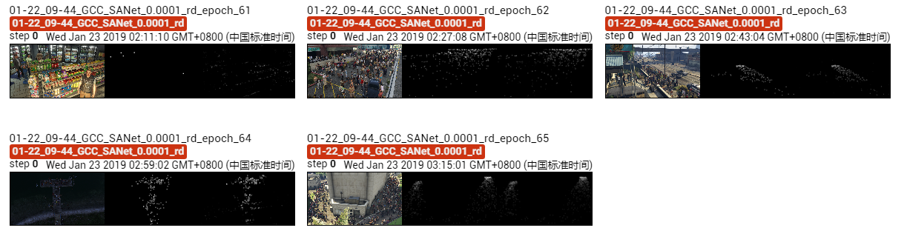

The results of SANet on GCC dataset using random splitting.

The model is trained ~65 epoches, which achieves MAE of **42.4** and MSE of **85.4**. 

## Screenshot of Training Process

## Visualization of Density Map

