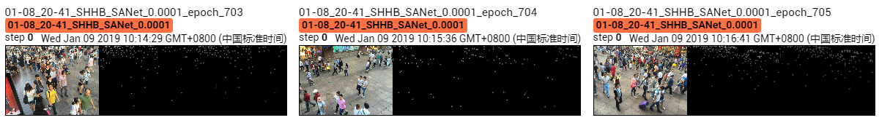

The results of SANet on Shanghai Tech B dataset.

Due to the limited time and machine, the model is trained ~700 epoches, which achieves MAE of **12.1** and MSE of **19.2**. 

## Screenshot of Training Process

## Visualization of Density Map

