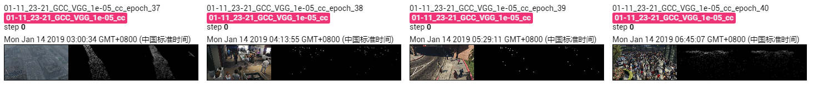

The results of VGG on GCC dataset using cross-camera splitting.

The model is trained 40 epoches, which achieves MAE of **57.6** and MSE of **133.9**. 

## Screenshot of Training Process

## Visualization of Density Map

