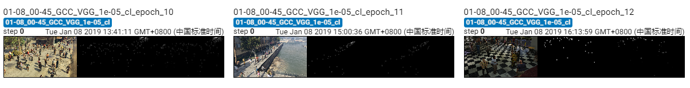

The results of VGG on GCC dataset using cross_location splitting.

The model is trained 44 epoches, which achieves MAE of **91.4** and MSE of **222.0**. 

## Screenshot of Training Process

## Visualization of Density Map

