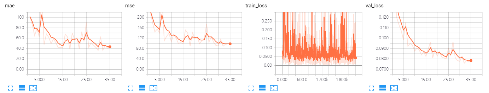
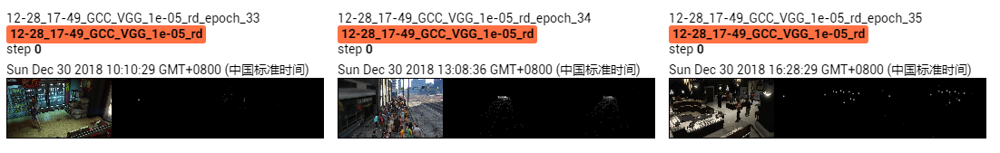

The results of VGG on GCC dataset using random splitting.

The model is trained 35 epoches, which achieves MAE of **36.6** and MSE of **88.9**. 

## Screenshot of Training Process

## Visualization of Density Map

