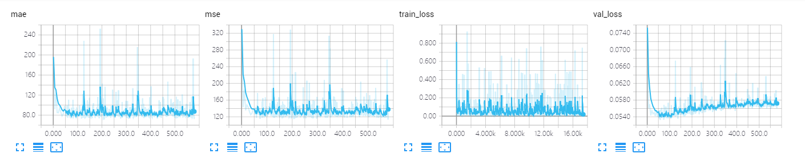
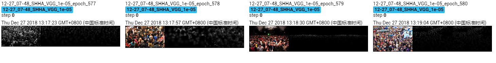

The results of VGG on Shanghai Tech A dataset.

Due to the limited time and machine, the model is trained ~600 epoches, which achieves MAE of **71.4** and MSE of **115.7**. 

## Screenshot of Training Process

## Visualization of Density Map

