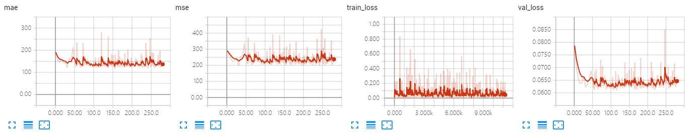

The results of VGG on UCF-QNRF dataset.

The model is trained ~300 epoches, which achieves MAE of **119.3** and MSE of **207.7**.

## Screenshot of Training Process

## Visualization of Density Map

