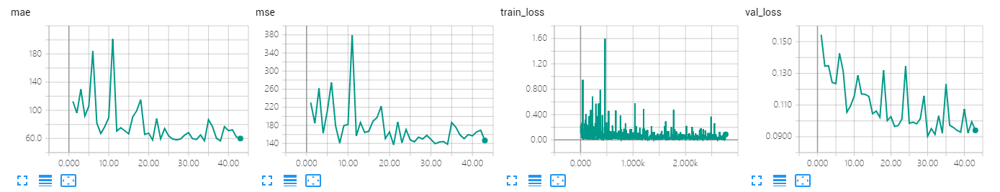

The results of VGG_DECODER on GCC dataset using cross-camera splitting.

The model is trained ~40 epoches, which achieves MAE of **56.9** and MSE of **138.3**. 

## Screenshot of Training Process

## Visualization of Density Map

