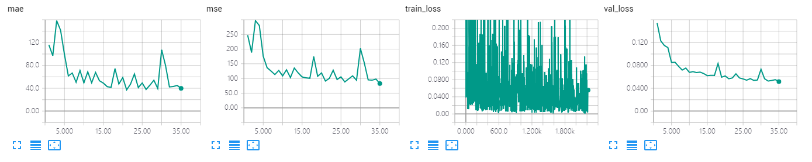

The results of VGG decoder on GCC dataset using random splitting.

The model is trained 35 epoches, which achieves MAE of **37.2** and MSE of **91.2**. 

## Screenshot of Training Process

## Visualization of Density Map

