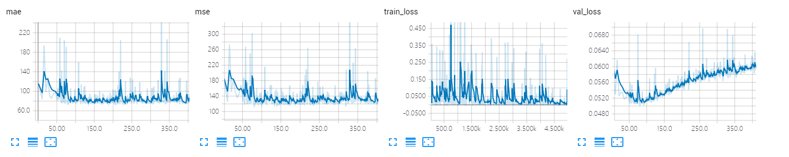
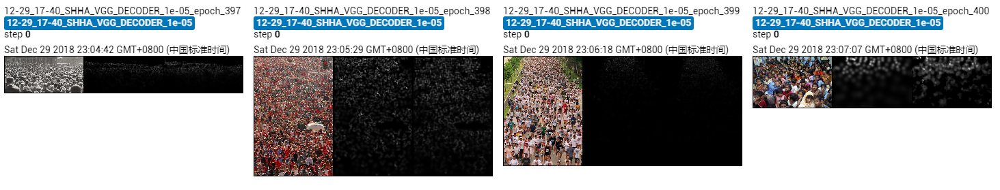

The results of VGG_decoder on Shanghai Tech A dataset.

The model is trained only ~400 epoches, which achieves MAE of **71.5** and MSE of **117.6**. 

## Screenshot of Training Process

## Visualization of Density Map

