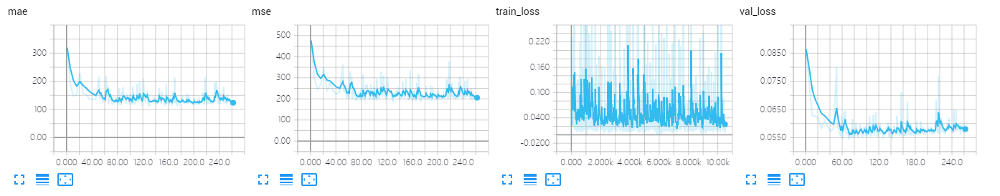
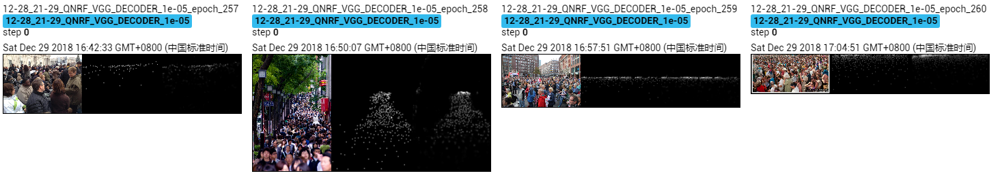

The results of VGG_decoder on UCF-QNRF dataset.

The model is trained ~300 epoches, which achieves MAE of **109.8** and MSE of **184.5**.

## Screenshot of Training Process

## Visualization of Density Map

